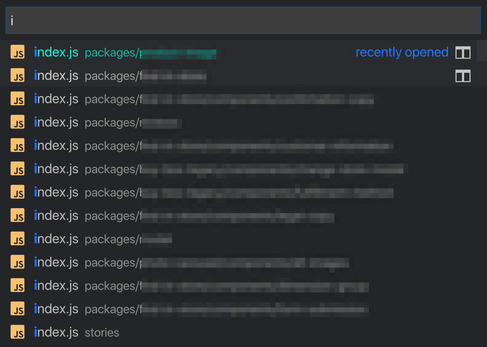

tldr; Do what works for you. I like barrel files, with or without TypeScript, and I think it's worth giving it a try if you haven't.

I noticed this tweet the other day:
<blockquote class="twitter-tweet" data-lang="en">
Component developers, which way do you do it and why? <a href="https://t.co/Xbh2mJ1Pu9">pic.twitter.com/Xbh2mJ1Pu9</a>
&mdash; Brad Frost (@brad_frost) <a href="https://twitter.com/brad_frost/status/1085951295368904706?ref_src=twsrc%5Etfw">January 17, 2019</a></blockquote>

<blockquote class="twitter-tweet" data-lang="en">
index.js, because I hate:  import Button from &#39;components/Button/Button.js&#39;  And some of my components only have a file, no folder:  - Button/index.js - Button/styles.css - Alert.js  Then if Alert needs more files, I can change it to Alert/index.js and none of my imports break.
&mdash; Ryan Florence (@ryanflorence) <a href="https://twitter.com/ryanflorence/status/1085951889781317632?ref_src=twsrc%5Etfw">January 17, 2019</a></blockquote>

<blockquote class="twitter-tweet" data-lang="en">
Button.js - easier to find the file I want.  Instead of typing “butind” i can type “btjs” and find it faster. Index is messy and comes from something totally unrelated, doesn’t communicate that this is the Thing.
&mdash; Jonathan Cutrell (@JCutrell) <a href="https://twitter.com/JCutrell/status/1085970803697557505?ref_src=twsrc%5Etfw">January 17, 2019</a></blockquote>

I've worked on a large scale codebase where every component was named `index.js`. It makes grepping for files cumbersome. I mean it's fine, you get used to it, but it's annoying.

[Dan Abromov](https://twitter.com/dan_abramov/status/1027245759232651270?lang=en) created a whole website to express his feeling on the matter - [react-file-structure.surge.sh](http://react-file-structure.surge.sh/).

## Default Exports Can Cause Problems
https://humanwhocodes.com/blog/2019/01/stop-using-default-exports-javascript-module/

## What About ES Modules in the Browser?

If you're shipping bare ES modules to a production app today, good for you! That's the dream. The reality is, that's not practical just yet for most of us. I think we'll be using module bundlers, or code transforms of one form or another for the foreseeable future. 
